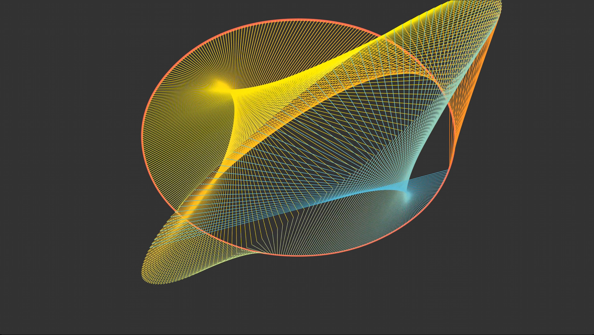
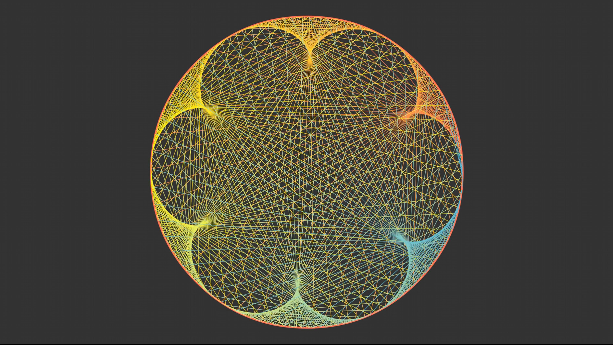

# ManimGL Animation Functions

This repository contains animation functions created using ManimGL library.

## Project Structure
- `Animation01.py`: Main animation script

## Requirements
- ManimGL
- Python 3.11

